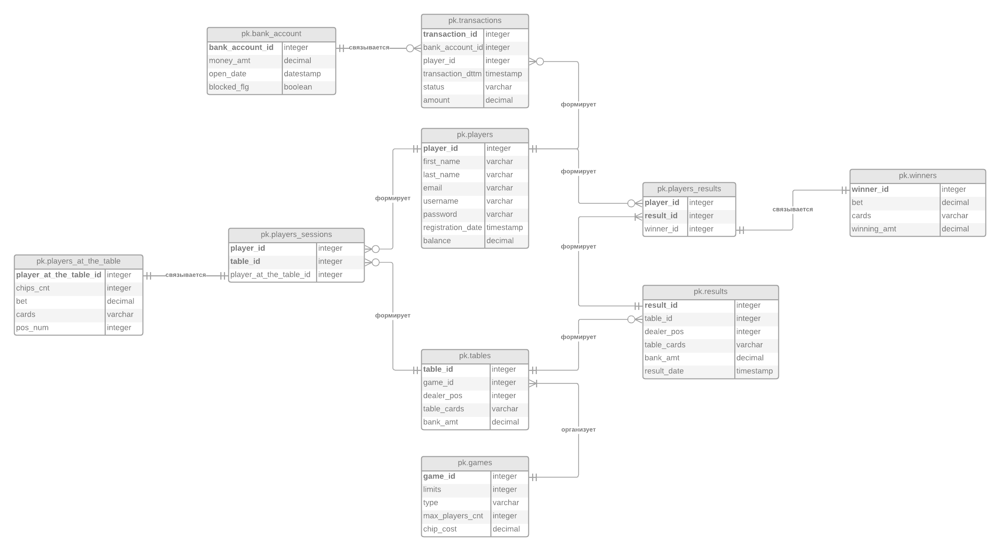

# Физическая модель

## Структура базы данных

## Описание таблиц

### Таблица `players'

[CREATE TABLE pk.players
(
player_id         INTEGER PRIMARY KEY,
first_name        VARCHAR(50)    NOT NULL,
last_name         VARCHAR(50)    NOT NULL,
email             VARCHAR(255)   NOT NULL,
username          VARCHAR(50)    NOT NULL UNIQUE,
password          VARCHAR(255)   NOT NULL,
registration_date TIMESTAMP      NOT NULL DEFAULT CURRENT_TIMESTAMP,
balance           DECIMAL(18, 2) NOT NULL CHECK (balance >= 0)
);]:#

| Название          | Описание                 | Тип данных     | Ограничения                        |
|-------------------|--------------------------|----------------|------------------------------------|
| player_id         | Идентификатор игрока     | INTEGER        | PRIMARY KEY                        |
| first_name        | Имя игрока               | VARCHAR(50)    | NOT NULL                           |
| last_name         | Фамилия игрока           | VARCHAR(50)    | NOT NULL                           |
| email             | Электронная почта игрока | VARCHAR(255)   | NOT NULL                           |
| username          | Имя пользователя игрока  | VARCHAR(50)    | NOT NULL UNIQUE                    |
| password          | Пароль игрока            | VARCHAR(255)   | NOT NULL                           |
| registration_date | Дата регистрации игрока  | TIMESTAMP      | NOT NULL DEFAULT CURRENT_TIMESTAMP |
| balance           | Баланс игрока            | DECIMAL(18, 2) | NOT NULL CHECK (balance >= 0)      |

### Таблица `transactions`

[CREATE TABLE pk.transactions
(
transaction_id   INTEGER PRIMARY KEY,
bank_account_id  INTEGER        NOT NULL,
player_id        INTEGER        NOT NULL,
transaction_dttm TIMESTAMP      NOT NULL DEFAULT CURRENT_TIMESTAMP,
status           VARCHAR(50)    NOT NULL CHECK (status IN ('SUCCESS', 'FAILED', 'PENDING', 'CANCELLED')),
amount           DECIMAL(18, 2) NOT NULL CHECK (amount >= 0),
FOREIGN KEY (bank_account_id) REFERENCES bank_accounts (bank_account_id),
FOREIGN KEY (player_id) REFERENCES players (player_id)
);]:#

| Название         | Описание                 | Тип данных     | Ограничения                                                              |
|------------------|--------------------------|----------------|--------------------------------------------------------------------------|
| transaction_id   | Идентификатор транзакции | INTEGER        | PRIMARY KEY                                                              |
| bank_account_id  | Идентификатор счета      | INTEGER        | FOREIGN KEY                                                              |
| player_id        | Идентификатор игрока     | INTEGER        | FOREIGN KEY                                                              |
| transaction_dttm | Дата и время транзакции  | TIMESTAMP      | NOT NULL DEFAULT CURRENT_TIMESTAMP                                       |
| status           | Статус транзакции        | VARCHAR(50)    | NOT NULL CHECK (status IN ('SUCCESS', 'FAILED', 'PENDING', 'CANCELLED')) |
| amount           | Сумма транзакции         | DECIMAL(18, 2) | NOT NULL CHECK                                                           |

### Таблица `bank_accounts`

[CREATE TABLE pk.bank_accounts
(
bank_account_id INTEGER PRIMARY KEY,
player_id       INTEGER        NOT NULL,
balance         DECIMAL(18, 2) NOT NULL CHECK (balance >= 0),
FOREIGN KEY (player_id) REFERENCES players (player_id)
);]:#

| Название        | Описание             | Тип данных     | Ограничения                   |
|-----------------|----------------------|----------------|-------------------------------|
| bank_account_id | Идентификатор счета  | INTEGER        | PRIMARY KEY                   |
| player_id       | Идентификатор игрока | INTEGER        | FOREIGN KEY                   |
| balance         | Баланс счета         | DECIMAL(18, 2) | NOT NULL CHECK (balance >= 0) |

### Таблица `games`

[CREATE TABLE pk.games
(
    game_id         INTEGER PRIMARY KEY,
    limits          INTEGER        NOT NULL CHECK (limits > 0),
    type            VARCHAR(50)    NOT NULL CHECK (type IN ('HOLDEM', 'OMAHA', 'OMAHA_HI_LO', 'SEVEN_CARD_STUD',
                                                            'SEVEN_CARD_STUD_HI_LO', 'SHORT_DECK')),
    max_players_cnt INTEGER        NOT NULL CHECK (max_players_cnt > 0 AND max_players_cnt <= 9),
    chip_cost       DECIMAL(18, 2) NOT NULL CHECK (chip_cost >= 0)
);]:#

| Название        | Описание                        | Тип данных     | Ограничения                                                                                                           |
|-----------------|---------------------------------|----------------|-----------------------------------------------------------------------------------------------------------------------|
| game_id         | Идентификатор игры              | INTEGER        | PRIMARY KEY                                                                                                           |
| limits          | Лимит игры                      | INTEGER        | NOT NULL CHECK (limits > 0)                                                                                           |
| type            | Тип игры                        | VARCHAR(50)    | NOT NULL CHECK (type IN ('HOLDEM', 'OMAHA', 'OMAHA_HI_LO', 'SEVEN_CARD_STUD', 'SEVEN_CARD_STUD_HI_LO', 'SHORT_DECK')) |
| max_players_cnt | Максимальное количество игроков | INTEGER        | NOT NULL CHECK (max_players_cnt > 0 AND max_players_cnt <= 9)                                                         |
| chip_cost       | Стоимость фишки                 | DECIMAL(18, 2) | NOT NULL CHECK (chip_cost >= 0)                                                                                       |

### Таблица `players_sessions`

[CREATE TABLE pk.players_sessions
(
player_id               INTEGER NOT NULL,
table_id                INTEGER NOT NULL,
players_at_the_table_id INTEGER NOT NULL,
PRIMARY KEY (player_id, table_id),
FOREIGN KEY (players_at_the_table_id) REFERENCES players_at_the_table (players_at_the_table_id)
);]:#

| Название                | Описание                       | Тип данных | Ограничения |
|-------------------------|--------------------------------|------------|-------------|
| player_id               | Идентификатор игрока           | INTEGER    | PRIMARY KEY |
| table_id                | Идентификатор стола            | INTEGER    | PRIMARY KEY |
| players_at_the_table_id | Идентификатор игрока за столом | INTEGER    | FOREIGN KEY |

### Таблица `players_at_the_table`

[CREATE TABLE pk.players_at_the_table
(
    players_at_the_table_id INTEGER PRIMARY KEY,
    chips_cnt               INTEGER        NOT NULL CHECK (chips_cnt >= 0),
    bet                     DECIMAL(18, 2) NOT NULL CHECK (bet >= 0),
    cards                   VARCHAR(255)   NOT NULL,
    pos_num                 INTEGER        NOT NULL CHECK (pos_num >= 0 AND pos_num <= 8)
);]:#

| Название                | Описание                       | Тип данных     | Ограничения                                    |
|-------------------------|--------------------------------|----------------|------------------------------------------------|
| players_at_the_table_id | Идентификатор игрока за столом | INTEGER        | PRIMARY KEY                                    |
| chips_cnt               | Количество фишек игрока        | INTEGER        | NOT NULL CHECK (chips_cnt >= 0)                |
| bet                     | Ставка игрока                  | DECIMAL(18, 2) | NOT NULL CHECK (bet >= 0)                      |
| cards                   | Карты игрока                   | VARCHAR(255)   | NOT NULL                                       |
| pos_num                 | Позиция игрока за столом       | INTEGER        | NOT NULL CHECK (pos_num >= 0 AND pos_num <= 8) |

### Таблица `tables`

[CREATE TABLE pk.tables
(
table_id    INTEGER PRIMARY KEY,
game_id     INTEGER        NOT NULL,
dealer_pos  INTEGER        NOT NULL CHECK (diller_pos >= 0 AND diller_pos <= 8),
table_cards VARCHAR(255)   NOT NULL,
bank_amt    DECIMAL(18, 2) NOT NULL CHECK (bank_amt >= 0),
FOREIGN KEY (game_id) REFERENCES games (game_id)
);]:#

| Название    | Описание                 | Тип данных     | Ограничения                                          |
|-------------|--------------------------|----------------|------------------------------------------------------|
| table_id    | Идентификатор стола      | INTEGER        | PRIMARY KEY                                          |
| game_id     | Идентификатор игры       | INTEGER        | FOREIGN KEY                                          |
| dealer_pos  | Позиция дилера за столом | INTEGER        | NOT NULL CHECK (diller_pos >= 0 AND diller_pos <= 8) |
| table_cards | Карты на столе           | VARCHAR(255)   | NOT NULL                                             |
| bank_amt    | Сумма в банке на столе   | DECIMAL(18, 2) | NOT NULL CHECK (bank_amt >= 0)                       |

### Таблица `results`

[CREATE TABLE pk.results
(
result_id   INTEGER PRIMARY KEY,
table_id    INTEGER        NOT NULL,
dealer_pos  INTEGER        NOT NULL CHECK (dealer_pos >= 0 AND dealer_pos <= 8),
table_cards VARCHAR(255)   NOT NULL,
bank_amt    DECIMAL(18, 2) NOT NULL CHECK (bank_amt >= 0),
result_date TIMESTAMP      NOT NULL DEFAULT CURRENT_TIMESTAMP,
FOREIGN KEY (table_id) REFERENCES tables (table_id)
);]:#

| Название    | Описание                 | Тип данных     | Ограничения                                          |
|-------------|--------------------------|----------------|------------------------------------------------------|
| result_id   | Идентификатор результата | INTEGER        | PRIMARY KEY                                          |
| table_id    | Идентификатор стола      | INTEGER        | FOREIGN KEY                                          |
| dealer_pos  | Позиция дилера за столом | INTEGER        | NOT NULL CHECK (dealer_pos >= 0 AND dealer_pos <= 8) |
| table_cards | Карты на столе           | VARCHAR(255)   | NOT NULL                                             |
| bank_amt    | Сумма в банке на столе   | DECIMAL(18, 2) | NOT NULL CHECK (bank_amt >= 0)                       |
| result_date | Дата результата          | TIMESTAMP      | NOT NULL DEFAULT CURRENT_TIMESTAMP                   |

### Таблица `players_results`

[CREATE TABLE pk.players_results
(
results_id INTEGER NOT NULL,
player_id  INTEGER NOT NULL,
winner_id INTEGER NOT NULL,
PRIMARY KEY (results_id, player_id),
FOREIGN KEY (results_id) REFERENCES results (result_id)
);]:#

| Название   | Описание                 | Тип данных | Ограничения |
|------------|--------------------------|------------|-------------|
| results_id | Идентификатор результата | INTEGER    | PRIMARY KEY |
| player_id  | Идентификатор игрока     | INTEGER    | PRIMARY KEY |
| winner_id  | Идентификатор победителя | INTEGER    | PRIMARY KEY |

### Таблица `winners`

[CREATE TABLE pk.winners
(
    winner_id   INTEGER PRIMARY KEY,
    bet         DECIMAL(18, 2) NOT NULL CHECK (bet >= 0),
    cards       VARCHAR(255)   NOT NULL,
    winning_amt DECIMAL(18, 2) NOT NULL CHECK (winning_amt >= 0)
);]:#

| Название    | Описание                 | Тип данных     | Ограничения                       |
|-------------|--------------------------|----------------|-----------------------------------|
| winner_id   | Идентификатор победителя | INTEGER        | PRIMARY KEY                       |
| bet         | Ставка игрока            | DECIMAL(18, 2) | NOT NULL CHECK (bet >= 0)         |
| cards       | Карты игрока             | VARCHAR(255)   | NOT NULL                          |
| winning_amt | Выигрыш игрока           | DECIMAL(18, 2) | NOT NULL CHECK (winning_amt >= 0) |

